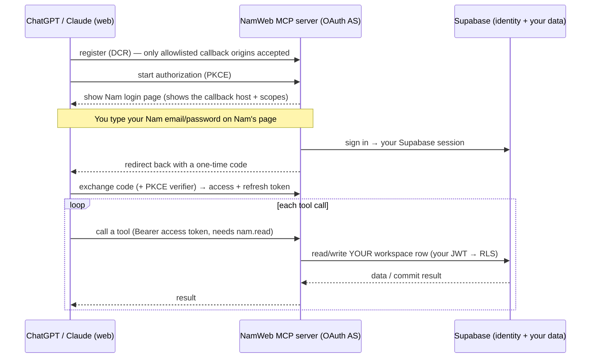

# MCP auth & security — a plain-language overview

Companion to [design.md](design.md). This explains **how the remote MCP server authenticates and
protects a workspace**, in normal terms, plus **what the pre-deploy hardening (#1055) changed and
why**. Written to be reviewable without OAuth/security expertise.

## The one-paragraph version

The MCP server is a **separate backend** that lets ChatGPT/Claude *web* read and write your NAM
workspace by chatting. It is its own **OAuth login server**: the AI connects, you log in with your
Nam (Supabase) account on a Nam-branded page, and the AI gets a **token** scoped to *your* data. Every
action the AI takes runs under **your** Supabase identity, so the database's row-level security (RLS)
is the same wall that protects the web app — the AI can never see or touch another user's workspace.
It's **additive**: it reads/writes the same Supabase row the web app uses, through the same
version-guarded save path, so it can't corrupt anything, and turning it off doesn't affect the app.

## How a connection works

**Key ideas, plainly:**
- **PKCE** — a standard handshake that stops someone intercepting the one-time code from using it.
- **Scopes** — `nam.read` (view) and `nam.write` (change). A read-only token genuinely can't write.
  Since #1116 **both are granted by default** to every connection the owner signs in — the opt-in
  write-consent checkbox was retired (the sole owner always enabled it, so it was pure friction).
  Write is still never taken from the *client's* requested scope (a connector can't escalate itself;
  a refresh can only narrow, never widen — #1050). A connection may still narrow itself to read-only,
  and the write tools stay **visible-but-refusing** in that case (a stable tool list; a read-only call
  returns a clear "nam.write not granted" message rather than the tool vanishing).
- **The token is opaque** — a random string; we store only its *hash*, and it maps to your Supabase
  session behind the scenes. The AI never sees your password or your Supabase tokens.
- **RLS is the real wall** — every read/write carries *your* JWT, so Supabase only ever returns/edits
  *your* rows. Both review passes confirmed no way around this.

## The "grant" model (the one worth understanding — #1051)

Instead of stuffing your Supabase session into every token, there's **one shared record per
authorization — a "grant"** — that holds the session, scopes, and workspace. Access and refresh
tokens are just *pointers* to that grant. Two payoffs:

1. **No desync.** When your Supabase session is refreshed, we update it in the grant *once*, and both
   the access and refresh tokens see the fresh session. (Before, they could drift apart and the
   refresh would break.)
2. **Theft detection.** Each refresh token carries a **generation number**. Refreshing bumps it. If an
   *old* refresh token shows up (a sign it was stolen and the thief is racing you), we treat it as
   theft and **revoke the whole grant** — every token for that authorization stops working.

## What the hardening fixed (findings → fixes)

A dual security review (an inline pass + an independent Codex pass) ran before any deploy. Both agreed
tenant isolation was sound; the fixes were about the **OAuth lifecycle + deploy posture**. Each row
below is one PR-worth of change.

| Severity | Problem (before) | Fix | PR |
|---|---|---|---|
| **Critical** | A stray `NAM_MCP_DEV_NOAUTH=1` in a deploy would serve an **unauthenticated** read+write endpoint | Refuses to start in production / on https; binds loopback-only | #1050 |
| **High** | A read-only token could **refresh itself into write** | Refresh scopes must be a subset of the grant | #1050 |
| **High** | Trusting any proxy header let attackers **spoof their IP** past the login rate-limit | Trust exactly the real proxy hop; bounded, dual (IP + account) limiter | #1050 |
| **High** | Auth codes weren't atomically single-use → a **race could mint two token families** | Claim the code with one atomic delete | #1051 |
| **High** | Anyone could register a client and **phish your login** to their own callback | **Redirect-origin allowlist** (fail-closed) + the login page names the callback host | #1052 |
| **High** | Tokens, client secrets, and **Supabase sessions were stored in plaintext** | Tokens stored **hashed**; sessions **AES-256-GCM encrypted** at rest | #1053 |
| Medium | Read scope not required at the endpoint; unsupported scopes broadened to full | Require `nam.read`; never broaden | #1050 |
| Medium | MCP/Supabase refresh could **desync** | One shared grant session (above) | #1051 |
| Medium | No **reuse detection** / family revocation | Generation-based reuse detection (above) | #1051 |
| Medium | Store never cleaned up; refresh tokens never expired | Sliding grant expiry + a scheduled prune | #1053 |
| Medium | Write tools accepted a **structurally invalid parent** (e.g. a project under a leaf action) | Enforce the SPA's own parent-type/move rules | #1054 |

## What you configure at deploy (fail-closed by design)

The server **won't run insecurely**: several of these are *required* in production, and it refuses to
start (or refuses registrations) if they're missing.

| Env var | Purpose |
|---|---|
| `NAM_MCP_DATABASE_URL` | Persistent OAuth store (else in-memory, drops on restart) |
| `NAM_MCP_ENCRYPTION_KEY` | **Required** with the DB store — encrypts sessions at rest (`openssl rand -hex 32`) |
| `NAM_MCP_ALLOWED_REDIRECT_ORIGINS` | **Required** in prod — the connector callback origins (e.g. `https://claude.ai,https://chatgpt.com`) |
| `NAM_MCP_ISSUER_URL` | The public `https://` origin the server is reachable at |
| `NAM_MCP_TRUST_PROXY` | Proxy hop count (default `1`) |
| `NAM_MCP_GRANT_TTL_DAYS` | Idle-authorization lifetime (default 30) |

## Where to look while reviewing

The **test names are the plain-English guarantees** — skim these:
- `mcp/auth/provider.test.ts` — reuse revokes family, revoke = ownership + family, no-desync
- `mcp/auth/scopes.test.ts` — no scope escalation on refresh
- `mcp/auth/redirectAllowlist.test.ts` — off-list redirect rejected
- `mcp/auth/crypto.test.ts` — encrypt round-trip / tamper rejection
- `mcp/server.test.ts` — no-auth refused in production
- `mcp/writes.test.ts` — invalid parent rejected

## Residual / out of scope (deliberately)

- **Multi-instance**: the rate-limiter is per-process; a horizontally-scaled deploy would move it to a
  shared store. A single instance (the plan) is fine.
- **Client-secret hashing**: the connectors we target are public PKCE clients (no secret).
- A **final independent Codex re-review** of the settled surface is the gate that flips
  "do not deploy" → "safe to host" (see #1055).
