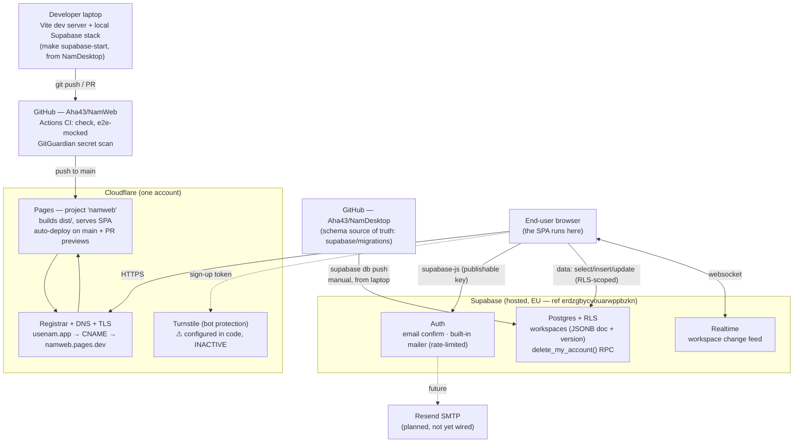

# Production topology — current realization of NamWeb

> Status: **living snapshot (2026-06-16).** What is *actually wired up* in production today and how
> the pieces relate — the **map**. The **journey** that built it (steps + gotchas) is
> [`go-live-playbook.md`](./go-live-playbook.md); the go-live *checklist* is
> [`../features/launch/design.md`](../features/launch/design.md). Update this doc whenever the
> realized system changes.

## One-paragraph summary

NamWeb is a **static SPA** (React + Vite) hosted on **Cloudflare Pages** at **`usenam.app`**. There
is **no backend of our own** — the browser talks **directly** to a **hosted Supabase project**
(Postgres + Auth + Realtime) in the **EU**. The entire workspace is a single JSONB row guarded by an
optimistic version counter, and **Row-Level Security is the only thing protecting one user's data
from another**. The database **schema is owned by the NamDesktop repo**; NamWeb is purely a client
of the same project. Deploys are automatic: push to `main` → Pages builds → live.

## System diagram

## Service inventory

| Service | Role in prod | Key identifiers | Config / secrets live in |
|---|---|---|---|
| **Developer laptop** | Local dev: Vite dev server + local Supabase stack | `make supabase-start` (NamDesktop) | local `.env` |
| **GitHub — NamWeb** | Source, PRs, **Actions CI** (`check`, `e2e-mocked`) | `Aha43/NamWeb` | repo settings / Actions |
| **GitGuardian** | Secret-scan check on PRs | GH app integration | GitGuardian dashboard |
| **GitHub — NamDesktop** | **Schema source of truth** (migrations) | `Aha43/NamDesktop` `supabase/` | that repo |
| **Supabase (hosted)** | Postgres + Auth + RLS + Realtime + `delete_my_account` RPC | EU · project ref `erdzgbycvouarwppbzkn` · `https://erdzgbycvouarwppbzkn.supabase.co` | Supabase dashboard (auth config, keys) |
| **Cloudflare Pages** | SPA hosting; auto-deploy on `main`; PR previews | project `namweb` · `namweb.pages.dev` | Pages project env vars + settings |
| **Cloudflare Registrar/DNS/TLS** | Domain, DNS record, HTTPS cert | `usenam.app` · `CNAME @ → namweb.pages.dev` | Cloudflare DNS |
| **Cloudflare Turnstile** | Bot protection on sign-up | — | **inactive** (no `VITE_TURNSTILE_SITE_KEY`) |
| **End-user browser** | Runs the SPA; talks directly to Supabase | — | — |
| **Resend (SMTP)** | Transactional email | — | **planned, not wired** |

## Flows

**Request / data path.** User → `https://usenam.app` (Cloudflare DNS/TLS) → Pages serves the static
bundle. From there the SPA uses `supabase-js` with the **publishable key** to hit Supabase directly:
**Auth** for sign-up/sign-in/confirm, **Postgres** for RLS-scoped reads/writes of the `workspaces`
row, and a **Realtime** websocket for the cross-device change feed. No server of ours sits in the
middle.

**Deploy path.** Push/merge to `main` → Cloudflare Pages builds (`npm run build` → `dist/`) and
deploys to `usenam.app`. Each PR also gets a **preview deploy** that appears as a status check
alongside the GitHub Actions CI (`check`, `e2e-mocked`) and GitGuardian. **Schema** changes take a
separate, manual path: `supabase db push` from the **NamDesktop** repo against the prod project.

## Trust boundaries

- **RLS is the only data guard.** The browser holds the publishable key and talks straight to
  Postgres, so the `workspaces` row policy (`owner_user_id = auth.uid()`, named *"Users own their
  workspaces"*) is what isolates users. There is no server tier to fall back on.
- **Publishable key is public by design** — it ships in the bundle. The **`service_role` / secret
  key must never** appear in the SPA or the repo.
- **Build-time config:** all `VITE_*` vars are baked into the static bundle at build — treat them as
  public; nothing secret goes there.
- **Privileged ops** run as `SECURITY DEFINER` RPCs scoped to `auth.uid()` (e.g.
  `delete_my_account()`), not via elevated client keys.

## Not yet realized

- **Custom SMTP** — on Supabase's built-in mailer (dev-grade, rate-limited); Resend is planned.
- **Turnstile** — code present, **inactive** until keys are set (site key in Pages env + secret in
  Supabase auth).
- **Backups / recovery** — free plan has **no PITR**; off-platform `pg_dump` not yet in place.
- **Pause risk** — free plan pauses after ~7 days idle; Pro upgrade is the planned graduation.
- **No staging** — local dev + prod only.
- **MCP connector** — feature-complete in-repo but **not deployed**; not part of the prod web system.

## Ownership note

All production infrastructure (Cloudflare account, Supabase project, the CLI Personal Access Token)
currently sits on **one personal account**. Bus-factor / access hardening is a DevOps-sprint item.
