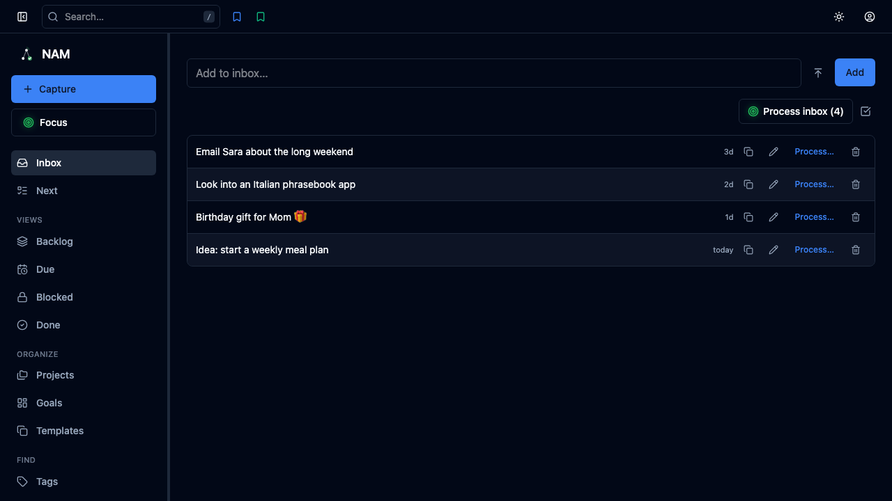
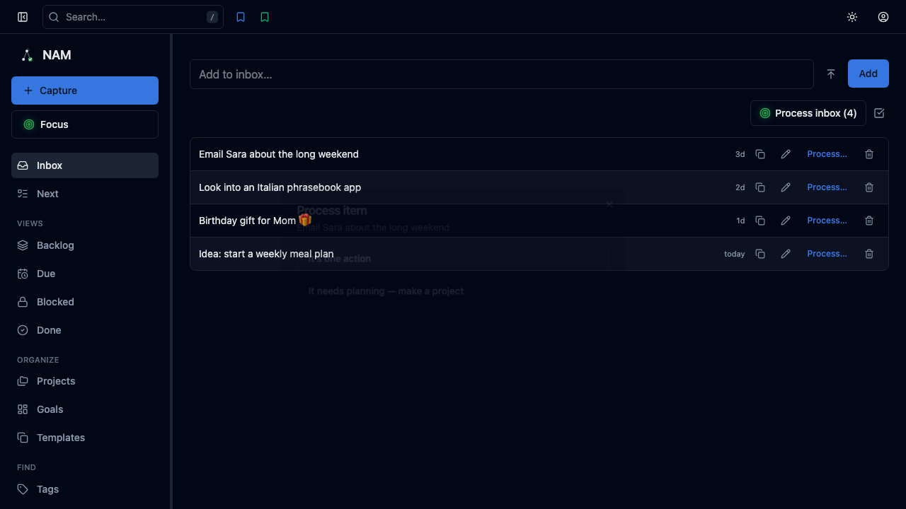
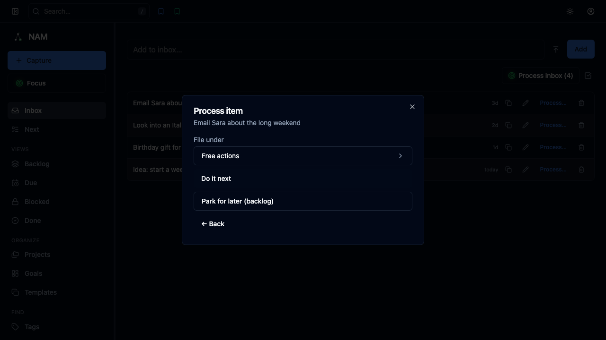
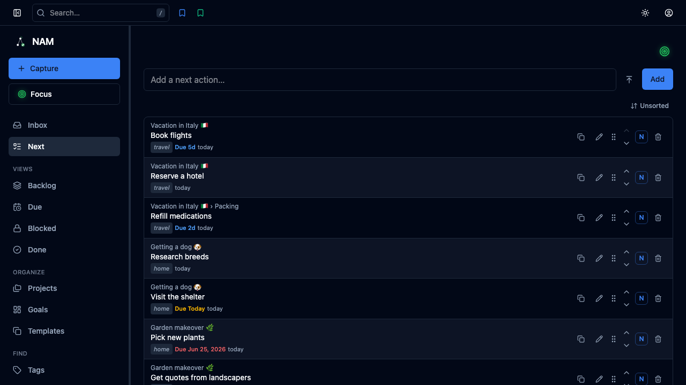
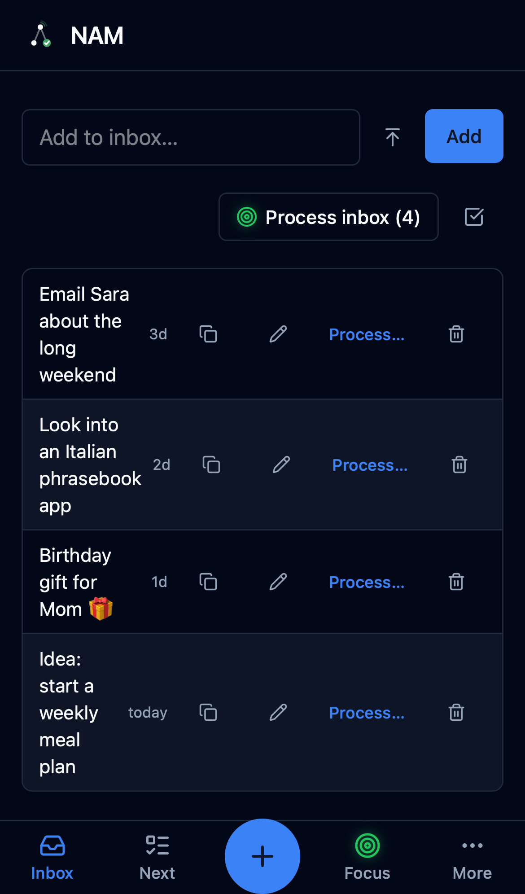
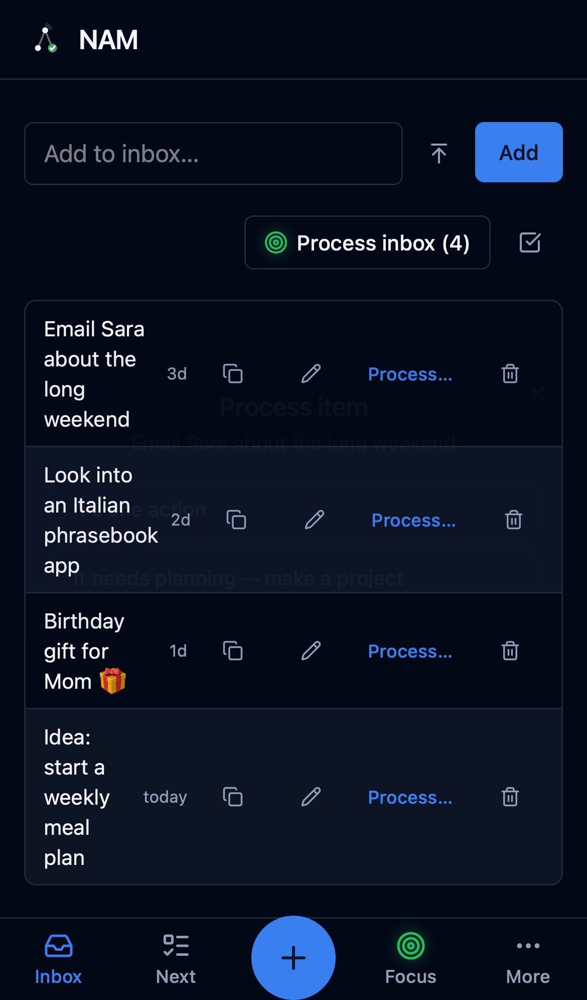
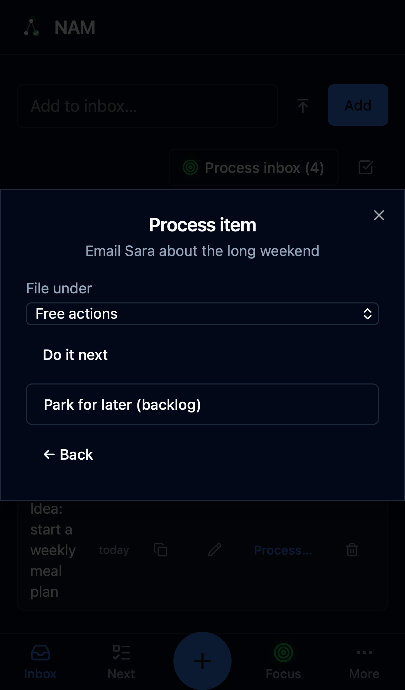

# How to process items in the inbox

## desktop

### 1. Everything you capture lands in the Inbox — one place to empty your head.

### 2. Pick an item and choose Process to clarify what it really is.

### 3. Decide its shape — here it is a single next action.

### 4. Send it onward and it leaves the Inbox for your Next list, ready to do.

## phone

### 1. Everything you capture lands in the Inbox — one place to empty your head.

### 2. Pick an item and choose Process to clarify what it really is.

### 3. Decide its shape — here it is a single next action.

### 4. Send it onward and it leaves the Inbox for your Next list, ready to do.

